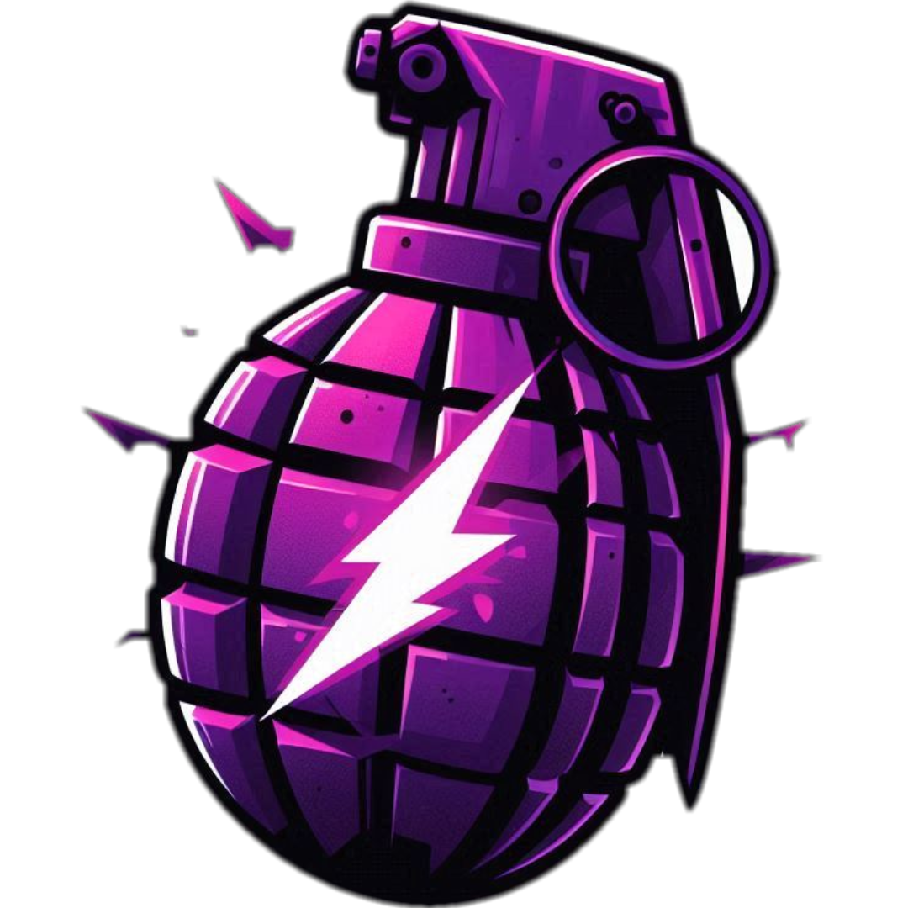

<div align="center">
   
   <h1>CS2 NoFlash</h1>
   <p>Your ultimate anti-flash tool for Counter-Strike 2</p>

   
   
   
   
   <a href="#features"><strong>Features</strong></a> •
   <a href="#installation"><strong>Installation</strong></a> •
   <a href="#usage"><strong>Usage</strong></a> •
   <a href="#troubleshooting"><strong>Troubleshooting</strong></a> •
   <a href="#contributing"><strong>Contributing</strong></a>
</div>

---

# Overview
CS2 NoFlash is an automated tool designed for Counter-Strike 2 that prevents the player from being fully flashed by automatically adjusting the flashbang alpha values in the game.

## Features
- **Anti-Flash Protection:** Automatically sets the flashbang alpha value to 0, preventing the player from being fully blinded.
- **Process Attachment:** Attaches to the `cs2.exe` process and reads memory values to apply real-time changes.
- **Logging**: Detailed logs are saved in `%LOCALAPPDATA%\Requests\ItsJesewe\crashes\nf_logs.log`.
- **Update Checker**: Automatically checks for updates from the GitHub repository.

## Installation
1. **Clone the Repository:**
   ```bash
   git clone https://github.com/Jesewe/cs2-noflash.git
   cd cs2-noflash
   ```

2. **Install Dependencies:**
   ```bash
   pip install -r requirements.txt
   ```

3. **Run the Script:**
   ```bash
   python main.py
   ```

## Usage
1. Ensure that Counter-Strike 2 is running.
2. Execute the script using the command above.
3. The script will automatically check for updates and fetch the necessary offsets from the provided sources.
4. The NoFlash protection will start automatically, reducing the flashbang effect to minimal.

## Troubleshooting
- **Failed to Fetch Offsets:** Ensure you have an active internet connection and that the source URLs are accessible.
- **Could Not Open `cs2.exe`:** Make sure the game is running and that you have the necessary permissions.
- **Unexpected Errors:** Check the log file located in the log directory for more details.

## Contributing
Contributions are welcome! Please open an issue or submit a pull request on the [GitHub repository](https://github.com/Jesewe/cs2-noflash).

## Disclaimer
This script is for educational purposes only. Using cheats or hacks in online games is against the terms of service of most games and can result in bans or other penalties. Use this script at your own risk.

## License
This project is licensed under the MIT License. See the [LICENSE](LICENSE) file for details.
