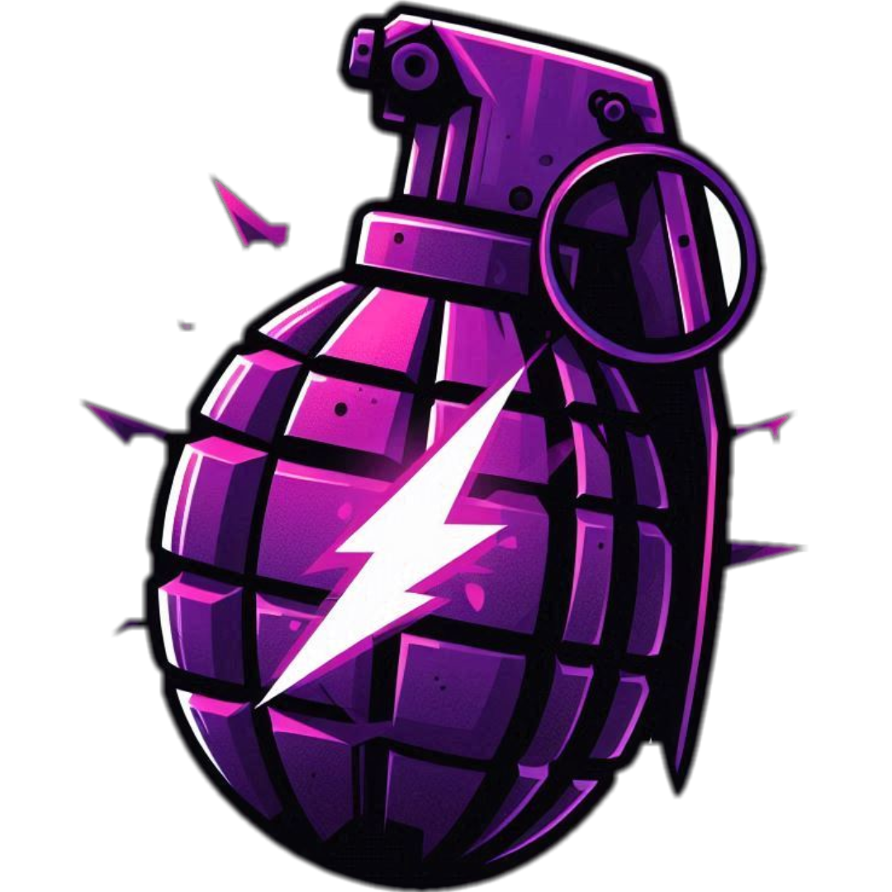

   
   <h1>🌟 CS2 NoFlash 🌟</h1>
   
Ваше найкраще рішення проти засліплення для Counter-Strike 2

   <a href="#Функції"><strong>Функції</strong></a> •
   <a href="#Інсталяція"><strong>Інсталяція</strong></a> •
   <a href="#Використання"><strong>Використання</strong></a> •
   <a href="#Налаштування"><strong>Налаштування</strong></a> •
   <a href="#Виправлення-неполадок"><strong>Виправлення неполадок</strong></a> •
   <a href="#участь-у-розробці"><strong>Участь у розробці</strong></a>
     
   
<strong>🌍 Переклади:</strong>

   
   
   
   
   

---

# Огляд
CS2 NoFlash — це автоматизований інструмент, розроблений для Counter-Strike 2, який запобігає повному засліпленню гравця шляхом автоматичного налаштування значень альфа каналу гранат засліплення у грі.

## Функції
- **Захист від засліплення:** Автоматично встановлює значення альфа каналу гранат засліплення на 0, запобігаючи повному засліпленню гравця.
- **Підключення до процесу:** Підключається до процесу cs2.exe та зчитує значення пам’яті для внесення змін у реальному часі.
- **Перевірка оновлень:** Автоматично перевіряє наявність останньої версії та повідомляє користувача про доступність оновлень.
- **Журнал помилок:** Реєструє помилки та важливі події в файл журналу для цілей налагодження.

## Інсталяція
1. **Клонування репозиторію:**
   
bash
   git clone https://github.com/Jesewe/cs2-noflash.git
   cd cs2-noflash

2. **Встановлення залежностей:**
   
bash
   pip install -r requirements.txt

3. **Запуск скрипта:**
   
bash
   python main.py

## Використання
1. Переконайтеся, що Counter-Strike 2 запущений.
2. Виконайте скрипт за допомогою команди, вказаної вище.
3. Скрипт автоматично перевірить наявність оновлень та завантажить необхідні зміщення з наданих джерел.
4. Захист NoFlash почне працювати автоматично, зменшуючи ефект засліплення гранат до мінімуму.

## Налаштування
- **Каталог журналів:** Файли журналу за замовчуванням зберігаються в каталозі %LOCALAPPDATA%\Requests\ItsJesewe\crashes. Ви можете змінити це, модифікуючи змінну LOG_DIRECTORY у скрипті.

## Виправлення неполадок
- **Не вдалося завантажити зміщення:** Переконайтеся, що у вас є активне інтернет-з’єднання і що джерела URL доступні.
- **Не вдалося відкрити cs2.exe:** Переконайтеся, що гра запущена і у вас є необхідні права.
- **Неочікувані помилки:** Перевірте файл журналу, що знаходиться в каталозі журналів, для отримання додаткової інформації.

## Участь у розробці
Внесок у проект вітається! Будь ласка, відкрийте питання або надішліть pull request у [репозиторії GitHub](https://github.com/Jesewe/cs2-noflash).

## Відмова від відповідальності
Цей скрипт призначений виключно для освітніх цілей. Використання чітів або хаків в онлайн-іграх суперечить умовам обслуговування більшості ігор і може призвести до блокування або інших санкцій. Використовуйте цей скрипт на свій власний ризик.

## Ліцензія
Цей проект ліцензований за ліцензією MIT. Дивіться файл [LICENSE](LICENSE) для отримання додаткової інформації.